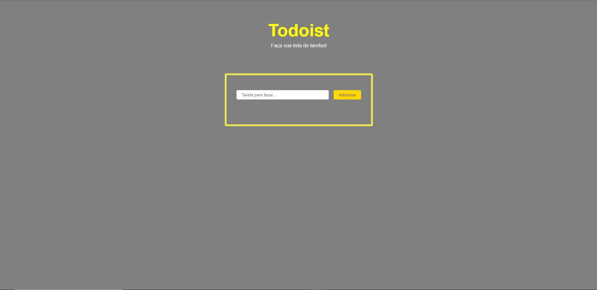

# listaDeTarefa

<h1 align="center"> TO DO</h1>

  <a href="#-tecnologias">Tecnologias</a>&nbsp;&nbsp;&nbsp;|&nbsp;&nbsp;&nbsp;
  <a href="#-projeto">Projeto</a>&nbsp;&nbsp;&nbsp;|&nbsp;&nbsp;&nbsp;
  <a href="#memo-licença">Licença</a>

 

  

## 🚀 Tecnologias

Esse projeto foi desenvolvido com as seguintes tecnologias:  

<ul>
  <li>HTML</li>
  <li>CSS</li>
  <li>JAVASCRIPT</li>
</ul>

## 💻 Projeto

Projeto criado para aprimorar o estudo nas principais tecnologias do desenvolvimento WEB.

- [Visite o projeto online](https://node-do-zero-5yuv.onrender.com/)

## :memo: Licença

Esse projeto está sob a licença MIT.

---

Feito com ♥ by Helena Lima :wave: [Meu Portifólio:]([https://discord.gg/rocketseat](https://portifolio-principal-three.vercel.app/)https://portifolio-principal-three.vercel.app/)